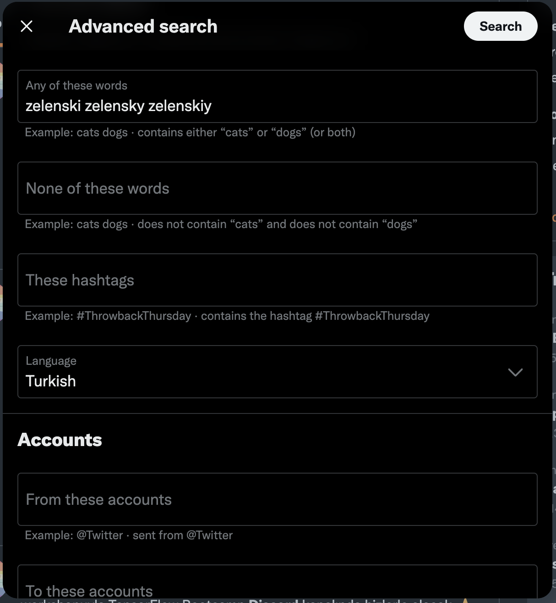

# twitter-preprocessing 

Twitter'dan snscrape aracılığıyla veri almak ve onu veri önişleme süreçlerinden geçirmek için bir tool. 

Direkt olarak tweetleri alıp bir CSV dosyası oluşturabilir ya da işlemek üzere bir dataframe'e kaydedebilirsiniz.

Arama yapmak için **[Twitter Advanced Search]**'ü kullanabilirsiniz. Buradan alacağınız query'i doğrudan uygulamaya ekleyebilirsiniz. 

<p align="center">
  
</p>

Buradan elde ettiğimiz query'i direkt olarak uygulamamıza verebiliriz.

```python
query = "(zelenski OR zelensky OR zelenskiy) lang:tr"
```

Verimizi elde etmek ve daha sonrasında kullanmak için, `csv_only` değerini `True` olarak belirleyebiliriz.

Daha sonra kullanmak üzere CSV olarak kaydetmek için.

```python
get_tweets(query, 100, csv_only=True)
```

Direkt olarak üstünde çalışmak için.

```python
tweets = get_tweets(query, 100)
```


[Twitter Advanced Search]: https://twitter.com/search-advanced
